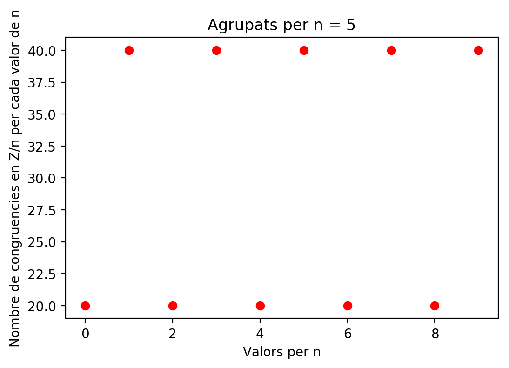
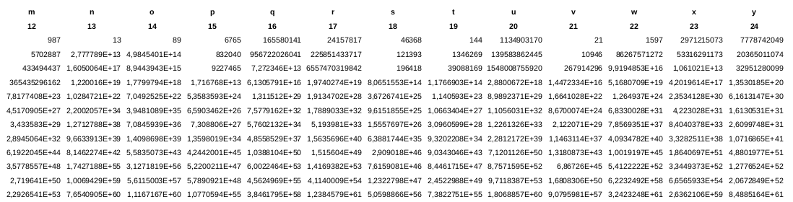

---
title: "Xifrat Àuric i Xifrat modular"
author: [Marc Sànchez Pifarré, GEINF (UDG-EPS)]
date: 13/10/2019
subject: "Criptografia"
tags: [Modular, arithmetics]
subtitle: "Tutor de la pràctica : Francesc Castro"
titlepage: true
titlepage-color: 06386e
titlepage-text-color: FFFFFF
titlepage-rule-height: 4
...

\newpage


# Auric cypher

## Introducció 

L'algoritme de xifratge que he generat consta de dues parts diferenciades. 

- Algoritme de xifratge àuric inventat per mi.
- Algoritme de xifratge Rail Fence.

## Context i estudi previ

Una part del temps invertit en aquesta pràctica ha sigut a l'estudi i les priopietats de la sèrie de fibonacci. 

Fibonacci és la sèrie en la que els seus números estan compostos per la suma dels dos components anteriors a la mateixa sèrie, existeixen infinits nombres de la sèrie de fibonacci. L'estudi ha començat en veient quines propietats interessants em podia aportar realitzant una cerca de la sèrie de fibonacci per la xarxa, intentant esbrinar quines aplicacions s'han realitzat en criptografia. 

Per sorpresa meva en la criptografia clàssica no existeixen algoritmes famosos, com els que hem vist a classe, per a l'aplicació d'aquesta série referent a criptografia, sí que s'han trobat moltes coincidències aplicades a disseny, dibuix i fins i tot relacionades amb la natura. 

L'estudi l'he enfocat en cercar propietats d'aquesta mateixa sèrie mitjançant l'aplicació de l'aritmètica modular. Primerament s'ha realitzat l'algoritme i s'han cercat nombres de la sèrie, ja que l'algoritme és molt costós no s'han aconseguit gaires nombres i s'han cercat els 300 primers nombres de la mateixa per tenir un conjunt de nombres prou gran per estudiar.


La primera prova que vaig realitzar va ser la més significativa, la meva idea inicial va ser llençar un bucle de 1 fins a 50 classificant els 300 nombres de la sèrie de fibonacci dins d'un diccionari clau valor, on la clau era el nombre d'aparicions i el valor la llista de colisions dels mateixos nombres a Z/n sent n la variable del bucle i generant els histogrames per cada iteració. La idea va sortir per el que anomenem la propietat de la raó àurea. 

$(a+b)/a = a/b$

En definitiva només m'he fixat en la propietat que dicta que donat un segment 'c' compós per dos segments 'a' i 'b', si a i b son segments àuris, llavors c també ho és. Evidentment. M'ha fet pensar, què passa si estudio, en forma de simulació, (no em considero matemàticament prou bó com per treure una regla matemàtica en tota la meva existència, menys en 2 setmanes...) la relació que pugui haver-hi entre la els nombres d'aquesta sèrie i les seves congruències a Z/n. 

Ajudant-me de l'algoritme següent que realitza aquesta classificació i torna el hashmap mostrarem una sèrie de gràfics interessants. 


```python
def generateAppearancesCount(fibonacci300, L):
    appearences = dict()
    for i in fibonacci300:
        number = i % L
        if number in appearences:
            appearences[number] += 1
        else:
            appearences[number] = 1
    return appearences
```


Generem els hashmap passant com a paràmetre els nombres de la sèrie i els valors per la n (mòdul) com a prova. 


```python
seq5 = generateAppearancesCount(fibonacci300, 5)
seq10 = generateAppearancesCount(fibonacci300, 10)
seq15 = generateAppearancesCount(fibonacci300, 15)
seq20 = generateAppearancesCount(fibonacci300, 20)
seq25 = generateAppearancesCount(fibonacci300, 25)
seq30 = generateAppearancesCount(fibonacci300, 30)
```


I mostrem els gràfics de com es comporten el nombre de colisions dels mateixos quan comprovem la seva congruència a Z/n. 


```python
import matplotlib.pyplot as plt
plt.plot(seq5.keys(), seq5.values(), 'ro')
plt.title("Agrupats per n = 5")
plt.xlabel('Valors per n')
plt.ylabel('Nombre de congruencies en Z/n per cada valor de n')
plt.show()
```

{#graphics }\


```python
plt.plot(seq10.keys(), seq10.values(), 'ro')
plt.title("Agrupats per n = 10")
plt.xlabel('Valors per n')
plt.ylabel('Nombre de congruencies en Z/n per cada valor de n')
plt.show()
```

{#graphics2 }\


```python
plt.plot(seq15.keys(), seq15.values(), 'ro')
plt.title("Agrupats per n = 15")
plt.xlabel('Valors per n')
plt.ylabel('Nombre de congruencies en Z/n per cada valor de n')
plt.show()
```

{#graphics3 }\


```python
plt.plot(seq20.keys(), seq20.values(), 'ro')
plt.title("Agrupats per n = 20")
plt.xlabel('Valors per n')
plt.ylabel('Nombre de congruencies en Z/n per cada valor de n')
plt.show()
```

{#graphics4 }\


```python
plt.plot(seq25.keys(), seq25.values(), 'ro')
plt.title("Agrupats per n = 25")
plt.xlabel('Valors per n')
plt.ylabel('Nombre de congruencies en Z/n per cada valor de n')
plt.show()
```

{#graphics5 }\


```python
plt.plot(seq30.keys(), seq30.values(), 'ro')
plt.title("Agrupats per n = 30")
plt.xlabel('Valors per n')
plt.ylabel('Nombre de congruencies en Z/n per cada valor de n')
plt.show()
```

{#graphics6 }\


Es pot detectar que per els 300 primers valors de la sèrie de fibonacci sense contar el 0, els gràfics del 5 i del 25 tenen una linealitat molt curiosa. I és que per 300 valors, hi ha el mateix nombre de congruents amb els diferents valors de 0 - n per els valors 5 i 25, concretament amb n = 25 tenim 12 valors exactes de congruència a cada n. Curiosament amb 25 valors podem codificar gairebé totes les lletres de l'alfabet anglés.  

La idea de tot plegat és tenir una manera de poder homogeneitzar l'IC de l'encriptat i que no depengui del llenguatge amb el que està escrit. Després de veure aixó em vaig tirar a la piscina.

## Algoritme inicial

Després de l'estudi inicial he realitzat diferents iteracions intentant lligar les propietats de l'aritmètica modular a aquesta característica de la sèrie de fibonacci. Per raons de temps no he explorat les propietats de la suma modular o la resta modular, simplement m'he quedat en la propietat : 

Donats : 

- a Congruent amb b en mòdul n
- c Com a nombre enter 

Tenim que : 

a + c Congruent amb b + c

Dit aixó he generat un algoritme d'encriptament que utilitza una taula de nombres de fibonacci per poder encriptar, i que utiltiza la propietat de la congruència de l'aritmètica modular per poder desencriptar. 

### Fites

Per motius òbvis de temps s'ha restringit molt l'algoritme inicial per simplificar-ne el seu funcionament. Es donen els següetns axiomes per a l'encriptació de qualsevol text. 

- L'alfabet és de 25 caràcters on el primer és la 'a' i l'últim la 'y'. Fent quadrar així el nombre de caràcters de l'alfabet amb el nombre de mòduls possibles a z/n. 
- No es processen llavors cap caràcter que estigui fóra d'aquest rang, entre el 97 i el 97 + 25 - 1 en codi ascii.

### Taula àurea. 

Utilitzant els 300 valors s'ha aconseguit una taula com la següent : 




On a cada columna s'hi sitúa el caràcter al que correspon l'encriptació i el seu valor de congruència a Z/n com a capçalera, mentre que a les files hi trobem els valors dels nombres de la sèrie de fibonacci. A cada columna hi ha els que son congruents entre ells i amb el nombre de la capçalera. 

Aquest algoritme té un problema molt gros en termes de criptografia, i és que si algú coneix la taula o coneix el rang de valors que pot prendre la clau generada, és molt fàcil de desencriptar. Per aquest motiu utilitzant l'aritmètica modular s'ha plantejat una segona iteració (millora) en l'algoritme inicial. 

### Algoritme de xifrat àuric (Substitució)

No segueix cap esquema dels algoritmes que hem vist a classe, ha sigut invenció de l'autor. 

L'algoritme de codificació es pot trobar al fitxer auric.py. Es parteix d'un algoritme cíclic, començant per la posició [0,0] de la taula, es llegeix el primer caràcter que es vol encriptar (sempre que estigui a dins del rang d'acceptació, és a dir, que formi part de l'alfabet), es transforma el seu valor en el valor decimal de la taula ascci i s'avança per la taula en horitzontal tantes caselles com el valor del caràcter ens marca, és cíclic per tant la posició 25 és la posició [25 % L][25 // L] on L = 25. 

Per exemple, Volem codificar 'aa': 

- Per la primera lletra 'a' s'avancen 97 valors i es cau a la columna 97%L i la fila 97//L. Obtinguent el seu corresponent valor de la sèrie de fibonacci. 
- Es porta un comptador dels passos que s'han realitzat per a cada caràcter processat. De moment al llegir només la 'a' el comptatge està a 97. 
- Per la segona lletra 'a' s'avancen 97 valors més des de l'última casella on ens hem situat anteriorment i es cau a la casella [(97+97)%L,(97+97)/L]. 

Es realitza aquesta metodologia successivament fins a arrivar al final del text xifrat on el resultat del xifrat anterior és 'wt' i s'ha generat una clau corresponent a l'últim valor obtingut entre 0 i 299. Aquesta clau és la que marca d'inici del desencriptat. 

Per tant la sortida consta de : 

- text xifrat 
- valor de la clau entre 0 i 299

### Algoritme de desxifrat (Substitució)

Utiltizem la mateixa taula per que hem utilitzat per encriptar, ara per desencriptar. L'algoritme per desencriptar és més simple peró té una gràcia afegida que no tenen els altres, i és que per poder desencriptar cal que hi hagi la relació de congruència entre un nombre de fibonacci de la taula i caràcter que segueix al caràcter que estem mirant. 

Per poder començar requerim la clau, i és que la casella de sortida serà la casella corresponent al final de l'encriptació, en aquest cas [clau%L][clau//L]. Donada aquesta casella cal : 

- Invertir la cadena encriptada (reverse) comencem per l'últim caràcter fins al primer. 
- Llegir el següent caràcter, avançar de forma inversa a la que s'ha encriptat per la taula en sentit contrari 97 caselles, ja que hem de moure'ns a dins dels 25 possibles valors de la 'a' a la 'y'. 
- Un cop situats hem de començar a comparar la congruència del caràcter següent de la cadena inversa, amb els següents 25 valors existents en forma de cercle, pararem quan es trobi una congruència entre el valor de fibonacci de la casella per la que avancem i el valor de la capçalera de la taula. 

Seguin l'exemple anterior i situats a la casella (97+97), si retrocedim 97 valors apareixem a la casella 97, comprovem si el valor de fibonacci de la casella és congruent amb el 22 corresponent al valor de la w xifrada, ho és per tant ja tenim la primera 'a', per trobar la segona 'a' simplement hem de transformar el valor restant en un caràcter. 

Podriem dir que : 

donats : 

- un caràcter c
- una posició n a la taula
- la posició i del caràcter c al text xifrat

El valor del desxifrat serà el primer valor congruent dins de la primera sèrie de 25 valors a des de n-97 fins a n-97-25, tal que el valor de fibonacci sigui congruent amb la codificació numèrica del caràcter i+1 del text. (veure l'algoritme o cridar-me a tutories per més informació.).

### IC En el codificat àuric

Estudiem l'IC del text de frankenstain codificat amb el primer algoritme, algoritme àuric, algoritme que en aquesta segona fase no existeix ja que s'ha modificat per aconseguir les mateixes propietats sense la sèrie de fibonacci. 

Suposarem un text en anglés per a l'encriptat i el posterior anàlisi de l'Index de coincidència. El text proposat és el llibre de frankenstain que es pot trobar a la referència [1] o bé al directori txt sota el nom de frankenstain. 

Després de codificar el text i desar-lo amb el nom de codificat.txt, obrim el fitxer que acabem de generar i filtrem tots els caràcters de l'alfabet fent un histograma de les aparicions. 


```python
histograma = dict()
book = ""
with open("txt/codificat-auri.txt", 'r', encoding='utf-8') as fileobj:
    for line in fileobj:  
        for ch in line: 
            if ch >= 'a' and ch <= 'z': 
                if ch in histograma:
                    histograma[ch] += 1
                else: 
                    histograma[ch] = 1

plt.plot(histograma.keys(), histograma.values(), 'ro')
plt.title("Histograma de caràcters del text codificat")
plt.xlabel("")
plt.ylabel("")
plt.show()
```

{#readbook }\


Com podem veure l'IC dels 25 caràcters és molt bo, si fem el càlcul serà molt proper a 1, deixant de banda que la z no s'utilitza pel xifrat. 

## Algoritme encriptació final (Substitució)

Utitilitzant la mateixa lógica que en l'anterior explicació s'ha realitzat una evolució de l'algoritme àuric per aconseguir desacoblar la clau de l'algoritme. En aquesta segona iteració s'han incorporat els següents features : 

- Ús d'una clau o password per poder xifrar i desxifrar.
- Eliminació de la taula àurea i generació d'una taula mitjançant el password. 
- El desencriptat no va de redera a endavant sinó que el text final tindrà n+1 caràcters on n és el nombre de caràcters del text inicial (no xifrat).
- Ús d'un delimitador al final del text xifrat que s'utiltiza per desxifrar.
- Incorporació de un caràcter com a marca d'inici de la taula ascii i un caràcter com a marca de fi. (el rang de caràcters que codifiquem.)
- S'han descartat els primers 32 caràcters de la taula ascii peró el rang és modificable. 

Així doncs, qualsevol text que estigui en ascii i que contingui valors d'entre el 32 fins el 127 serà processat per l'algoritme, tots els altres caràcters es deixen tal i com estan i l'algoritme rail fence explicat més endavant se n'encarrega de desordenar-los. 

La gràcia està en que l'aritmètica modular es pot adaptar de manera concisa de la mateixa manera que s'utilitzava anteriorment peró sense haver de tenir la sèrie de fibonacci sinó amb nombres d'un rang totalment aleatori, peró usant el mateix tipus de procediment. 

### Ús de la clau

La clau s'utilitza com a llavor per generar els nombres aleatòris que composaran la taula de xifrat. També s'utilitza per marcar el punter de sortida, és a dir, quina casella de la taula serà l'inicial, en l'algoritme àuric sempre era la primera casella de la taula mentre que en aquest és una casella a l'atzar d'entre les possibles. 

S'utiltiza la llargada de la clau en nombre de caràcters per a estipular els rails del railfence. 

## Exemples d'execució 

En el director txt hi ha els fitxers que s'han utiltizat com a jocs de proves. En el fitxer main.py hi ha 2 jocs de proves preparats per ser executats. A continuació es mostra l'execució del fitxer main.py en aquest informe autogenerat.  


```python
import os
import sys
sys.path.append(os.getcwd())
from auric import encode
from auric import decode
from RailFence import codifica
from RailFence import descodifica

def doAction(fileName, key, firstChar, lastChar):
    text = ""
    with open(fileName, 'r', encoding='utf-8') as fileobj:
        for line in fileobj:  
            for ch in line: 
                text += ch

    # matrix, columns, length = auric.generateMatrix(text, L)
    print("")
    encoded = encode(text, key, firstChar, lastChar)
    print("ENCODED TEXT By SUBSTITUTION :")
    print("-----------------------------------------------")
    print(encoded)

    print("")
    fenced = codifica(encoded, len(key))
    print("ENCODED TEXT By SUBSTITUTION + TRANSFORMATION :")
    print("-----------------------------------------------")
    print(fenced)

    print("")
    defenced = descodifica(fenced, len(key))
    print("DECODED TEXT By SUBSTITUTION + TRANSFORMATION :")
    print("-----------------------------------------------")
    print(defenced)

    print("")
    decoded = decode(defenced, key, firstChar, lastChar)
    print("DECODED TEXT By SUBSTITUTION + TRANSFORMATION :")
    print("-----------------------------------------------")
    print(decoded)


key = "frankenstain"
firstChar = 32
lastChar = 127
shortFileName = "txt/short.txt"
doAction(shortFileName, key, firstChar, lastChar)

print("-----------------------------------------------------------------------------------------------------")

longFileName = "txt/long.txt"
doAction(longFileName, key, firstChar, lastChar)
```

```

ENCODED TEXT By SUBSTITUTION :
-----------------------------------------------
[L_oz!%:ZBXms#&,?Gn#C*=?NZ`o$9?IX%EHb#pr&@`Xhu#7L\kqu)+2Gg0w(-EO^(H<EKXeky

ENCODED TEXT By SUBSTITUTION + TRANSFORMATION :
-----------------------------------------------
[sNbL(kL#Z#\-y_&`pkEo,orqOz?$&u^!G9@)(%n?`+H:#IX2<ZCXhGEB*%ugKX=E#0Xm?H7we

DECODED TEXT By SUBSTITUTION + TRANSFORMATION :
-----------------------------------------------
[L_oz!%:ZBXms#&,?Gn#C*=?NZ`o$9?IX%EHb#pr&@`Xhu#7L\kqu)+2Gg0w(-EO^(H<EKXeky

DECODED TEXT By SUBSTITUTION + TRANSFORMATION :
-----------------------------------------------
Project Gutenberg's Frankenstein, by Mary Wollstonecraft (Godwin)
Shelle
-----------------------------------------------------------------------------------------------------

ENCODED TEXT By SUBSTITUTION :
-----------------------------------------------
[OX^~02H\bg4Tlrx*4CKw8:INn$-3Bbfv&;ETjpuBb%n/DM]s{%:Zr|2;[dt(;K^+KY
s(@FLa"/16P|=R[]r3M]s4HQaw%*JMS`jp(.Nhx/BbMcw-7FLx9QZjx9Scy-MP]cw,2
79O^s4=?Ddx)IR\dmz5U^n}.DW]b/OQ`e&>GWe&@Pf'4D[af3Skm"BDdh{"$9Obh)-/@BER
Xho02RVis"(H`isw!AP`ou69Od%:CIint,6Cclv%9?LSsw(>KPpy{39Yjp$5;Pcez!&
T9?ATtlv$1;=Kl-28:MSg|=@MSg{"'GKT^kp2Rr\|1AQ`!5>@MZz/5;[u&<\^fhr"BL
[djl$*9e&>GM`f'?Eey#%2?_an{<?Eenp"3M)IKZ_ 5>@Uuy*9M]jp%ESY&FN^hw @BVv
`bp1FVv+AHOUh)3;JZhr"<\^mr38>@U^-

Oqaj7WBXl",;Ab#C*:MU_v|=KQqx)<\eg~)8@`gw+K[jp1?O]cr(HMWk!4J^sy~?Yi
NFOi*/9>^x)?_cs#*0DX8Xx[q'GL\|,<Qq 0FYh5UZ`bu6>H[h7Ww\l-<La")/1Dr3S
=U_ly:K^nr ",:f'p1IS`m.?Rby @Zj!4T^m|-17FJP~?_Ii",9Fftz(=]r{"BVk{+
ENTVi~3Scj+EUk~?ETZhrx-MPj+9Ss)/1DXxz*/O`su06I],Llfv-Majly'GVf{<AKQ
rl|3_ .Hhy')CJP]jz3_ .Hhl|+<>MWgvCcq,L`j~4:My:KQdn#,L\k,AJPp%)+29IV[
|k{=]}l|>^~h)8>U[n/3CYfk,@Vi!+BHh|-MVfy-7:GMmo0>H\cs'<Ragi

ENCODED TEXT By SUBSTITUTION + TRANSFORMATION :
-----------------------------------------------
[TNTs(LrJBZwD^eDhBsotsjTKM2@^$E?_j vhUXUejk
?[0H"l' 7Fkcr16lrCl,d%=Ui-sOlnj{;a3Mbj,dn&[{E"u,wp9lSRMf*eE
p@+r^l_gp!N_qF[)yp@Ff{jxDIylJ|Ln)][!7'Xr$p%K"MSMx2x}>a"R(66($?-grZh9ye5%BA"-"v~14Fc'Yh/:1ZJt++-X]'|P+`#+}n+:<^x-u:^/]`c9
).Gf$
H9C>5A2{\zre#n>EVH<
,|)?JOsGh71KIjPz
EMx,G3]<j,2l/BGR~*3BZ+1sjwS7IDW39X`OcK;T8"|/"&%p@SvO\
;=8O^i#L5WD^S!~(EUPzLV_j>~L9|3HMa04BbrK64p-c9RWeSOhidlPPt:'15B>2"UY
U^OAK@]s**\Uwrn`4?=Nkj*lf
zM4\I>Chmg2Cb%|YPH(7yO\]&kbos%vpclMGA;LG?3u&`hmqbQ`cy/0|Z\3rmT_]T~+/f{.3W:kV^Y|oiHKfn2
|Q.F-^db@mh0w:%yevSKQ[
M_MyFb)ra#qgr~9D,`lS
.^IrV?9Ov<H_gM,[~f-0\wv/;s=aNLMsm/P")2!C9{z$gT`u[`a)*Np33jCxw(?>X<b-
"?mi{iES`-Ah vyA
hkM>b8&D[(RwhxP4zOfB-
RAI?3!1|^!&dfnI9^1;87*)+HY^8Qu<=,R|""~TssMKy.C:J|),VHg:;Md@[%x9]=5Q'D/VPiL9&;=k5<j'{KMhFJ>W:<KMixXq6LU:b-,B3Z)uaQ'HcKPk8@f\4IE]tF]*/Qc?U`4d@i`nSY
=@p>\l?<Z]wVZ@BM\[W )x >a_fy19VSh/0j
)hqQp{>Vyc

DECODED TEXT By SUBSTITUTION + TRANSFORMATION :
-----------------------------------------------
[OX^~02H\bg4Tlrx*4CKw8:INn$-3Bbfv&;ETjpuBb%n/DM]s{%:Zr|2;[dt(;K^+KY
s(@FLa"/16P|=R[]r3M]s4HQaw%*JMS`jp(.Nhx/BbMcw-7FLx9QZjx9Scy-MP]cw,2
79O^s4=?Ddx)IR\dmz5U^n}.DW]b/OQ`e&>GWe&@Pf'4D[af3Skm"BDdh{"$9Obh)-/@BER
Xho02RVis"(H`isw!AP`ou69Od%:CIint,6Cclv%9?LSsw(>KPpy{39Yjp$5;Pcez!&
T9?ATtlv$1;=Kl-28:MSg|=@MSg{"'GKT^kp2Rr\|1AQ`!5>@MZz/5;[u&<\^fhr"BL
[djl$*9e&>GM`f'?Eey#%2?_an{<?Eenp"3M)IKZ_ 5>@Uuy*9M]jp%ESY&FN^hw @BVv
`bp1FVv+AHOUh)3;JZhr"<\^mr38>@U^-

Oqaj7WBXl",;Ab#C*:MU_v|=KQqx)<\eg~)8@`gw+K[jp1?O]cr(HMWk!4J^sy~?Yi
NFOi*/9>^x)?_cs#*0DX8Xx[q'GL\|,<Qq 0FYh5UZ`bu6>H[h7Ww\l-<La")/1Dr3S
=U_ly:K^nr ",:f'p1IS`m.?Rby @Zj!4T^m|-17FJP~?_Ii",9Fftz(=]r{"BVk{+
ENTVi~3Scj+EUk~?ETZhrx-MPj+9Ss)/1DXxz*/O`su06I],Llfv-Majly'GVf{<AKQ
rl|3_ .Hhy')CJP]jz3_ .Hhl|+<>MWgvCcq,L`j~4:My:KQdn#,L\k,AJPp%)+29IV[
|k{=]}l|>^~h)8>U[n/3CYfk,@Vi!+BHh|-MVfy-7:GMmo0>H\cs'<Ragi

DECODED TEXT By SUBSTITUTION + TRANSFORMATION :
-----------------------------------------------
She paused, weeping, and then continued, "I thought with horror, my
sweet lady, that you should believe your Justine, whom your blessed
aunt had so highly honoured, and whom you loved, was a creature
capable
of a crime which none but the devil himself could have perpetrated.
Dear William! dearest blessed child!  I soon shall see you again in
heaven, where we shall all be happy; and that consoles me, going as I
am to suffer ignominy and death."

"Oh, Justine!  Forgive me for having for one moment distrusted you.
Why did you confess?  But do not mourn, dear girl.  Do not fear.  I
will proclaim, I will prove your innocence.  I will melt the stony
hearts of your enemies by my tears and prayers.  You shall not die!
You, my playfellow, my companion, my sister, perish on the scaffold!
No!  No!  I never could survive so horrible a misfortune.
```


## Algoritme de xifrat (Transformació)

Un cop s'ha aplicat l'algoritme de xifrat per subsitució s'aplica l'algoritme de xifrat railfence. 

L'aplicació d'aquest algoritme és mitjançant la clau. s'utilitzen un nombre de rails variable entre 1 i |clau| % 25 + 1, per tant hi haurà entre 1 i 25 rails. S'ha optat per aquest sistema per integrar la clau al xifratge per transformació. S'ha volgut aplicar el 25 com a màxim nombre de rails degut a que ha sigut un nombe significant a la realització de la pràctica. El gran esforç en aquesta pràctica s'ha destinat a l'algoritme de substitució. 

S'ha utilitzat el mateix algoritme que s'ha vist a classe a les transparències amb la variant que aquest algoritme no requereix alfabet i treballa sobre tots els caràcters. Aquest fet ens ajuda a amagar els caràcters que no es poden xifrar amb l'algoritme de substitució. 

# Propietats de l'algoritme presentat

- Si tens la taula, saps l'algoritme i coneixes la clau pots desxifrar el missatge. (assimila als algoritmes clàssics)
- Es cerca homogeneitzar l'IC mitjançant la propietat de fibonacci % 25
- S'utiltiza l'aritmètica modular per poder desxifrar els caràcters. 

# Càlcul de l'IC. 

Realitzem el càlcul de l'IC del resultat de l'encriptació. Primerament mirem l'histograma d'aparicions de l'algoritme final, en aquest cas utiltizem el fitxer txt/codificat-modular.txt per veure fins a quin punt l'histograma de caràcters ens és prou bo per poder distingir o no si l'IC serà l'esperat, en general de la mateixa manera que el resultat de l'histograma de caràcters en el text codificat-auri.txt ha sigut bo per nosaltres, s'espera que utilitzant l'algoritme nou aquest també ho sigui. 


```python
histograma = dict()
book = ""
with open("txt/codificat-modular.txt", 'r', encoding='utf-8') as fileobj:
    for line in fileobj:  
        for ch in line: 
            if ch >= 'a' and ch <= 'z': 
                if ch in histograma:
                    histograma[ch] += 1
                else: 
                    histograma[ch] = 1

plt.plot(histograma.keys(), histograma.values(), 'ro')
plt.title("Histograma de caràcters del text codificat")
axes = plt.gca()
axes.set_ylim([0,5000])
plt.xlabel("")
plt.ylabel("")
plt.show()
```

{#graphic_IC_modular }\


```python

histograma = dict()
book = ""
with open("txt/codificat-modular.txt", 'r', encoding='utf-8') as fileobj:
    for line in fileobj:  
        for ch in line: 
            if ch >= 'A' and ch <= 'Z': 
                if ch in histograma:
                    histograma[ch] += 1
                else: 
                    histograma[ch] = 1

plt.plot(histograma.keys(), histograma.values(), 'ro')
plt.title("Histograma de caràcters del text codificat")
axes = plt.gca()
axes.set_ylim([0,5000])
plt.xlabel("")
plt.ylabel("")
plt.show()
```

{#graphic_IC_modular_2 }\


Com podem observar els caràcters es mouen entre les 4400 i les 4800 aparicions! **l'histograma, igual que hem vist en l'apartat de l'auric és molt prometedor per el càlcul de l'IC!**

# Referències

- [Taula ASCII](http://www.asciitable.com/)
- [Gutenberg](https://www.gutenberg.org)
- [Secció àurea, Wikipedia](https://ca.wikipedia.org/wiki/Secci%C3%B3_%C3%A0uria)
- [série de fibonacci](http://www.maths.surrey.ac.uk/hosted-sites/R.Knott/Fibonacci/fibtable.html)
- [Aritmètica modular](https://en.wikipedia.org/wiki/Modular_arithmetic)

pandoc informe.md -o informe.pdf --from markdown --template eisvogel --listings --pdf-engine=xelatex --table-of-contents
